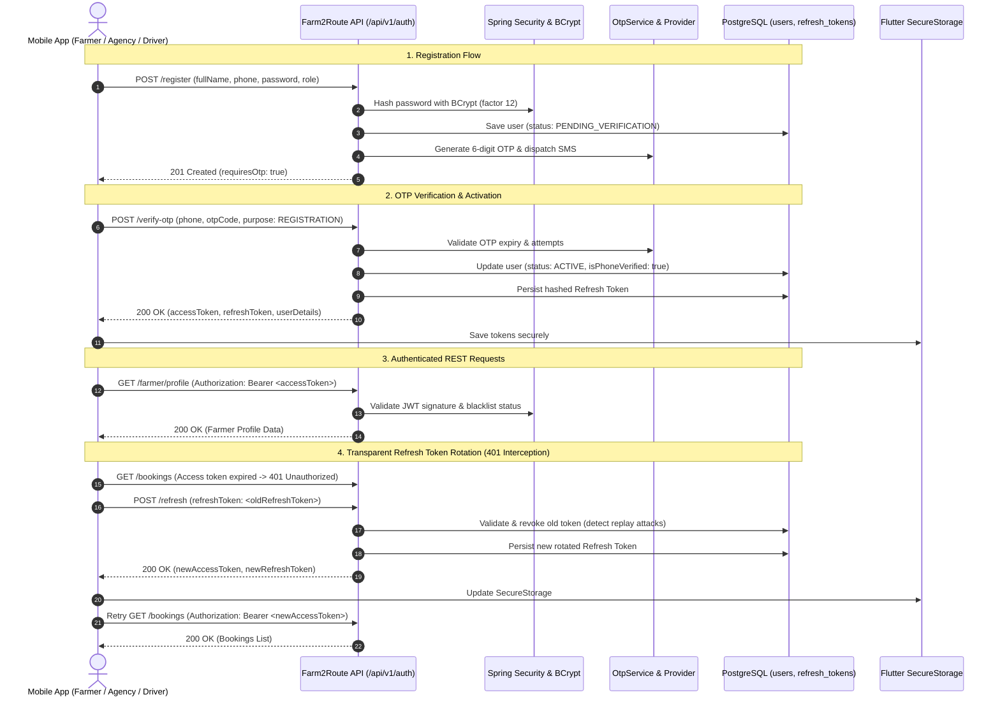

# Farm2Route — Authentication & Authorization Foundation

## 1. Authentication Lifecycle Sequence

---

## 2. Security Safeguards Implemented

1. **Password Hashing**: BCrypt with work factor 12.
2. **Access Token Lifespan**: Short-lived (15 minutes).
3. **Refresh Token Storage**: Server-side persistence with SHA-256 token hashing.
4. **Single-Use Refresh Token Rotation**: When a refresh token is exchanged, it is immediately revoked, preventing token theft and replay attacks.
5. **Immediate Token Revocation**: Logout blacklists the JWT in `TokenBlacklistService` and marks the database refresh token record as revoked.
6. **Rate Limiting on OTP**: 60-second cooldown between consecutive OTP requests and a maximum limit of 5 failed attempts per OTP lifecycle.
