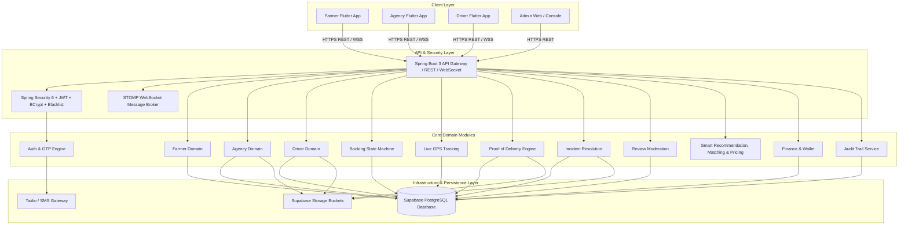

# Farm2Route — System Architecture Specification

## 1. High-Level Architectural Overview

Farm2Route is an agricultural logistics and fleet management platform engineered to connect farmers directly with verified logistics agencies and drivers, eliminating intermediary exploitation and optimizing harvest transportation through real-time GPS telemetry, Proof of Delivery (POD) validation, and automated financial settlements.

---

## 2. Technology Stack & Framework Choices

### Backend
- **Language/Platform**: Java 21 LTS
- **Framework**: Spring Boot 3.3.4
- **Security**: Spring Security 6, JJWT (HMAC-SHA256), BCrypt (Cost factor 12)
- **Data Access**: Spring Data JPA / Hibernate
- **Database**: Supabase PostgreSQL managed via Flyway (`V1` to `V16`)
- **Real-Time Telemetry**: Spring WebSocket with STOMP over SockJS
- **Documentation**: OpenAPI 3.0 / Swagger UI (SpringDoc 2.6.0)

### Mobile
- **Framework**: Flutter 3 (Dart)
- **Design System**: Material 3 Responsive Architecture
- **State Management**: Flutter Riverpod (`StateNotifierProvider`)
- **Networking**: Dio with `AuthInterceptor` (automatic refresh token rotation)
- **Secure Persistence**: `flutter_secure_storage` (Android Keystore / iOS Keychain)
- **Navigation**: GoRouter with asynchronous auth state redirect guards
