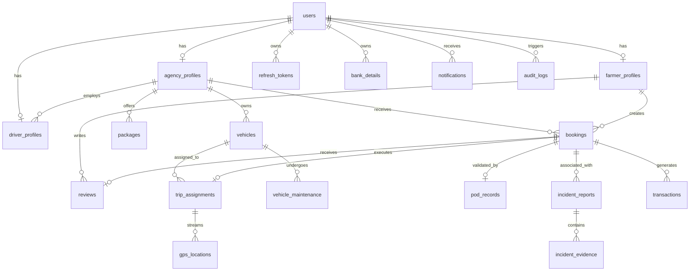

# Farm2Route — Entity Relationship Diagram & Database Overview

---

## Entity Summary Table

| Entity | Primary Key | Key Foreign Keys | Purpose |
|---|---|---|---|
| `users` | `UUID` | - | Identity, credentials hash, role, account status |
| `refresh_tokens` | `UUID` | `user_id` | Server-side refresh token rotation and revocation tracking |
| `otp_verifications` | `UUID` | - | Transient OTP lifecycle with attempt counters and rate limits |
| `farmer_profiles` | `UUID` | `user_id` | Farm location, acreage, and crop specializations |
| `agency_profiles` | `UUID` | `user_id` | Business registration, tax ID, and KYC compliance |
| `driver_profiles` | `UUID` | `user_id`, `agency_id` | Driving license, NIC, KYC status, and ratings |
| `vehicles` | `UUID` | `agency_id`, `assigned_driver_id` | Registration number, payload weight, volume, refrigeration |
| `packages` | `UUID` | `agency_id` | Rates per km/kg, origin-destination routes, schedule days |
| `bookings` | `UUID` | `farmer_id`, `agency_id`, `driver_id` | Cargo specs, addresses, status state-machine, fare |
| `trip_assignments` | `UUID` | `booking_id`, `driver_id`, `vehicle_id` | Active dispatch and transit workflow |
| `gps_locations` | `UUID` | `trip_id`, `booking_id`, `driver_id` | High-frequency telemetry coordinates for live tracking |
| `pod_records` | `UUID` | `booking_id`, `driver_id` | Geotagged delivery photo, digital recipient signature |
| `incident_reports` | `UUID` | `booking_id`, `reported_by_user_id` | Cargo damage, accident, delays, or theft investigation |
| `incident_evidence`| `UUID` | `incident_id` | Attached evidence images/videos |
| `reviews` | `UUID` | `booking_id`, `farmer_id`, `agency_id` | Dual-sided driver & agency ratings and feedback |
| `vehicle_maintenance` | `UUID` | `vehicle_id` | Maintenance service log and cost records |
| `notifications` | `UUID` | `user_id` | Real-time push and in-app alerts |
| `transactions` | `UUID` | `booking_id`, `payer_user_id`, `payee_user_id` | Payments, commission deductions, and payouts |
| `audit_logs` | `UUID` | `actor_id` | Immutable security audit trail |
